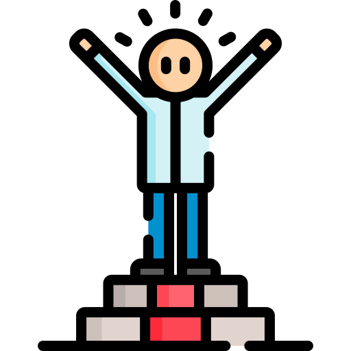

# Don't Evaporate

## By: Ryan Callebs

### A spin on the classic game Hangman

## 

# [Play Here](https://callebs-game-unit1.surge.sh/)

### Gameplay

A user attempts to guess a random hidden word shown that at the start, only the length of the word is shown, notated by underscores.

The user will click on any letter of the alphabet to make their guess. If that letter is in the hidden word, it will appear. If a letter appears multiple times in a word a player only needs to guess that letter once to have all instances appear on the gameboard.

If a letter is guessed that is not in the word, the player's opacity will decrease by 1/6. After six incorrect guesses the player will have evaporated and the game will be over.

If the player guesses the hidden word before the stick figure is completed, they will have won that round and have full opacity restored.

After a round is over the player can click the reset button to have a new hidden word replace the previous word and the keyboard will be reset. Resetting the game will clear the board, the opacity of the player, and the incorrect guess count will be set back to zero.

---

### Basic Objective

- Guess the hidden word before the image is invisible.

---

## Credits

- Jan Horak
- John Jacobs
- Quentin Donnelly
- Mark Brashear
- Lillian Benton

[MDN JavaScript](https://developer.mozilla.org/en-US/docs/Web/JavaScript) | [HTML Dom Elements](https://www.w3schools.com/jsref/dom_obj_all.asp) | [CSS Basics](https://www.w3schools.com/css/default.asp) | [Linking Between Pages](https://www.w3schools.com/js/js_window_location.asp) | [Player Image](https://www.vecteezy.com/vector-art/38104978-funny-stick-figure-hand-drawn-style-for-print) | [Start Page GIF](https://tenor.com/view/peace-ghost-gif-4978918) | [FlexBox Properties](https://css-tricks.com/snippets/css/a-guide-to-flexbox/) | [Splice Arrays](https://developer.mozilla.org/en-US/docs/Web/JavaScript/Reference/Global_Objects/Array/splice) | [Change Button Colors](https://stackoverflow.com/questions/72558029/how-to-change-a-buttons-color-when-clicked-on-it-and-change-it-back-to-its-orig)
